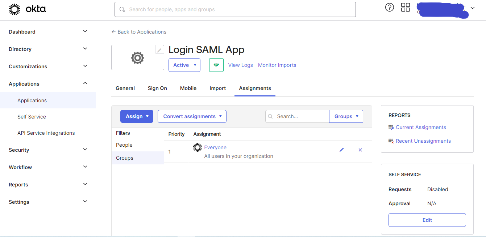

# How to implement SAML 2.0 with Node.js

For this project I am using Okta in order to autenticate users with SSO.The purpose of this project is understand how we can implement SAML 2.0 in Node.js.

```js
// Passport configuration
passport.use(
  new SamlStrategy(
    {
      path: process.env.CALLBACK_URL,
      audience: process.env.AUDIENCE,
      signatureAlgorithm: process.env.ALGORITHM,
      logoutUrl: process.env.LOGOUT_URL,
      entryPoint: process.env.ENTRY_POINT,
      issuer: process.env.ISSUER,
      protocol: "http://",
      cert: certFile, // cert must be provided
    },
    function (profile, done) {
      return done(null, profile);
    }
  )
);
```

## Configuration
1. Install the Node Packages Modules executing: `npm install`.
2. Go to <a href="https://developer.okta.com/" title="Okta Developers" target="_blank">Okta Developers Website</a>  and sign in or create an account.
3. Then We need to create a new Application.To do that follow this steps:
### A. Go to Applications


### B. Create a new App


### C. Select SAML 2.0


### D. Set a Name for the App


### E. Set the Audience URL
Use this URL in the `.env` file.


### F. Click Finish


### G. Navigate to Sign On Tab


### H. Copy the SSO URL
Use this URL in the `.env` file.


### I. Copy the Logut URL
Use this URL in the `.env` file.


### J. Navigate to assignments tab
We need to add assignments


### K. Assign some people
Click in the button of Assign People


### L. Assign Everyone


4. Then you will need to paste some of the values shown before so in the root of this project create a `.env` file with this keys, and paste the values that you saw in the screenshots:

```
    ISSUER=http://localhost:3012
    ENTRY_POINT=https://dev-someCustomID.okta.com/app/dev-someID_appName/someKey/sso/saml
    LOGOUT_URL=https://dev-someCustomID.okta.com
    CALLBACK_URL=http://localhost:3012/login/callback
    AUDIENCE=http://localhost:3012
    ALGORITHM=sha2
    SECRET_KEY=super_secret_key
```

5. Finally run this command in your terminal: `npm run start` or `npm run dev`

# How to test it?
You should navigate to `http://localhost:3012/dashboard` and it should redirect to a login Okta form. Once that you have already inserted your credentials it should allow you visit the `http://localhost:3012/dashboard` page.

# TODO
Discover how to use the Relay State ?
